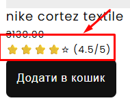

# ♿ Shopify — Покращення доступності (Accessibility / A11y)

## 📋 Опис завдання

Мета — провести аудит доступності Shopify-теми, виявити порушення стандартів WCAG 2.1 та виправити їх. Основний фокус зроблено на підтримці навігації клавіатурою, коректній роботі скрінрідерів та виправленні семантичних помилок у кастомних секціях.

**Етапи роботи:**

1.  Автоматизований аудит за допомогою **WAVE Evaluation Tool**.
2.  Ручне тестування навігації клавіатурою (`Tab`, `Enter`, `Space`).
3.  Виправлення помилок у HTML/Liquid коді та CSS стилях.
4.  Повторний аудит для підтвердження результатів.

---

## 🔍 Аналіз та Виправлення (Work Done)

Під час аудиту було виявлено та виправлено ряд критичних проблем у секціях `banner-product`, `featured-products`, `designers` та контактній формі.

### 🔹 1. Навігація клавіатурою (Focus Management)

**Проблема:** При ручному тестуванні виявлено, що у секції `banner-product` (та інших елементах) відсутній візуальний індикатор фокусу при переміщенні клавішею `Tab`. Користувач не бачив, де він знаходиться. Також аналогічна проблема була у інших секціях.
**Рішення:**

- Додано класи Tailwind `focus-visible:ring-2! focus-visible:ring-primary!` для інтерактивних елементів.
- Це забезпечило чітке виділення активного елемента без впливу на дизайн при кліку мишкою.

Проблема з фокусом показано на прикладі секції `banner-product`:

Приклад вирішення проблеми з фокусом на прикладі секції `banner-product`:

### 🔹 2. Семантика та Інтерактивність

**Проблема:** У секції `banner-product` перемикачі кольорів були реалізовані через тег `` з атрибутом `role="button"`. Це ускладнювало взаємодію та не гарантувало повної підтримки клавіатури.
**Рішення:**

- Зображення обгорнуто в нативний тег `<button type="button">`.
- Це автоматично додало підтримку фокусу та подій клавіатури.

### 🔹 3. Форми та Лейбли

**Проблема:** Інструмент WAVE показав помилку "Missing form label" у секції `featured-products` (сортування) та у контактній формі (honeypot).
**Рішення:**

- У селекті сортування знайдено та видалено зайвий пробіл у атрибуті `for` лейбла, що відновило зв'язок з `id` селекта.
- У контактній формі для прихованого поля-пастки (`trap`) додано `aria-label="Spam protection"`.

Скріншот з WAVE щодо атрибута `for` лейбла:

### 🔹 4. Адаптація для скрінрідерів (ARIA)

**Проблема:** Деякі елементи створювали "шум" або не мали контексту для незрячих користувачів.
**Рішення:**

- **Зірочки рейтингу:** Приховано візуальні символи (`aria-hidden="true"`) та додано загальний опис `aria-label="Рейтинг: 4.5 із 5"`.
- **Кнопки кошика:** Додано динамічний `aria-label="Додати в кошик: {{ product.title }}"`, щоб розрізняти кнопки в списку товарів.
- **Посилання дизайнерів:** Додано `aria-label` з попередженням про відкриття у новій вкладці (`opens in a new tab`).

На скріншоті зображено зірочки рейтингу про які йшла мова вище:

### 🔹 5. Контрастність (Visual Design)

**Проблема:** У секції `designers` світло-сірий текст та деякі кольорові акценти не відповідали вимогам контрастності WCAG AA.
**Рішення:**

- Замінено кольори тексту на більш темні/контрастні відтінки у CSS.

Картка дизайнера до змін:

Картка дизайнера після змін:

---

## 📊 Результати аудиту (WAVE)

В результаті оптимізації вдалося усунути всі критичні помилки та помилки контрастності.

| Етап                 |  Errors  | Contrast Errors |  Alerts  |
| :------------------- | :------: | :-------------: | :------: |
| **До виправлень**    |   1 ❌   |      18 ❌      |  17 ⚠️   |
| **Після виправлень** | **0** ✅ |   **6\*** ✅    | **8** ✅ |

\_\*Залишкові зауваження стосуються прихованих елементів та нативних стилів Shopify, що не впливають на доступність критично важливого функціоналу.\*

**Звіт "До":**

**Звіт "Після":**

---

## 🔧 Технології

- **HTML5/Semantic Web:** `button`, `label`, `section`, `h1-h6` hierarchy.
- **WAI-ARIA:** `aria-label`, `aria-hidden`, `aria-live`, `role="status"`.
- **CSS / Tailwind:** `focus-visible`, color contrast adjustments.
- **Tools:** WAVE Evaluation Tool, Chrome DevTools.

---

## 🔗 Ресурси

- **GitHub (branch: `accessibility`)**
  [https://github.com/krutobok/shopify-tkachenko-oleksandr-test-store/tree/accessibility](https://github.com/krutobok/shopify-tkachenko-oleksandr-test-store/tree/accessibility)

- **Стор Shopify:**
  [https://tkachenko-oleksandr-test-store.myshopify.com/?preview_theme_id=184114905397](https://tkachenko-oleksandr-test-store.myshopify.com/?preview_theme_id=184114905397)
  🔑 Пароль: `nowvol`
